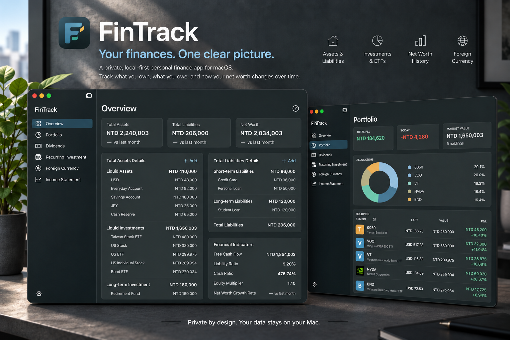

# FinTrack

[English](README.md) · [繁體中文](README.zh-TW.md)

[](https://github.com/chgwyellow/personal_fin/tags)
[](https://github.com/chgwyellow/personal_fin/releases)
[](https://github.com/chgwyellow/personal_fin/releases)
[](https://www.swift.org/)
[](https://developer.apple.com/xcode/swiftui/)
[](https://www.sqlite.org/)
[](LICENSE)

<p align="center">
  
</p>

<h3 align="center">把自己的財務，看得更清楚。</h3>

<p align="center">
  一套以隱私與本機儲存為核心的 macOS 個人財務管理 App。<br>
  集中掌握資產、負債、投資、外幣與淨值，了解財務狀況如何隨時間改變。
</p>

## 把個人財務集中在一個地方

FinTrack 將個人財務中原本分散的資訊集中管理，讓你掌握完整的財務狀況，而不需要把財務資料交給線上帳號或訂閱服務。

你可以管理現金、資產、負債、投資、股利、定期投資與外幣餘額，並讓自己的財務資料庫保留在 Mac 上。

需要計算目前價值時，FinTrack 會取得股價與匯率等外部公開資料；你手動輸入的資料、交易、餘額與快照則保留在本機。

## FinTrack 能為你做甚麼

### 掌握完整的財務狀況

將資產、負債、投資與淨值集中查看，不必分散管理多份清單或試算表。建立快照後，可以觀察淨值如何隨時間變化。

### 了解自己的投資組合

追蹤台股、美股與 ETF，並以各自的原始幣別管理。查看投資組合市值、資產配置、資本損益與每日損益，同時將實際買入資訊保留在本機。

FinTrack 的定位是投資組合追蹤與個人財務分析，而不是即時交易工具。

### 整理定期投資

建立定期投資計畫，並輸入實際完成的買入交易。FinTrack 將投資計畫與已完成的交易分開管理，讓投資組合反映真正持有的部位。

### 管理股利與收入

管理股利與損益表項目，讓投資收入可以與其他財務資訊一起查看。

### 管理外幣

將外幣餘額、匯率與交易資料和其他資產一起管理。

### 建立自己的淨值歷史

建立手動或定時淨值快照，並以不同時間區間查看歷史變化。快照讓你不只看到今天的數字，也能理解整體財務狀況如何改變。

## 隱私優先，本機為核心

FinTrack 不需要建立帳號，也不需要登入。FinTrack 沒有用來儲存使用者資料的後端伺服器。你的財務資料庫會使用 SQLite 儲存在自己的 Mac 上，不會上傳到 FinTrack。

只有在需要股價、匯率等資訊時，程式才會連線取得外部公開資料。

> **你的財務資料，留在自己的 Mac。**

## FinTrack 是什麼，又不是什麼

FinTrack 是一套 **個人財務追蹤與分析工具**，協助你了解：

- 我目前擁有哪些資產？
- 我目前負擔多少負債？
- 我的淨值是多少？
- 我的投資組合表現如何？
- 我的資產如何配置？
- 我的整體財務狀況隨時間發生了什麼變化？

FinTrack 不是券商，也不是交易終端。它不會代理股票下單、連接券商帳戶、自動匯入券商交易、移動你的資金，或自動執行定期投資。

已完成的投資交易與定期投資買入內容，需要由使用者自行輸入。

## 核心功能

- **財務總覽** — 集中管理資產、負債、投資與淨值
- **淨值歷史** — 建立手動與定時快照，查看財務狀況的歷史變化
- **投資組合** — 追蹤台股、美股與 ETF，並保留原始幣別
- **投資分析** — 查看投資組合市值、配置、資本損益與每日損益
- **定期投資** — 管理定期投資計畫與已完成的買入交易
- **股利與收入** — 管理股利與損益表項目
- **外幣管理** — 管理外幣餘額、匯率與交易資料
- **本機儲存** — 使用 SQLite 將財務資料保留在自己的 Mac

## 下載測試版

### 下載步驟

1. 開啟 [GitHub Releases](https://github.com/chgwyellow/personal_fin/releases)。
2. 點開最新版本，例如 `v0.1.2`。
3. 往下捲動到 **Assets**，必要時點擊展開。
4. 下載 **`FinTrack-0.1.2.zip`**。
5. 在「下載項目」中開啟剛下載的 ZIP。
6. 將解壓縮後的 `FinTrack.app` 移到 `/Applications`。
7. 第一次開啟時，對 App 按右鍵並選擇「打開」。
8. 如果 macOS 仍阻擋，請到「系統設定 → 隱私權與安全性」選擇「仍要打開」。

目前測試版只支援 Apple Silicon Mac，且尚未完成簽章與公證。未來版本的檔案名稱可能會有不同的版本號。

## 資料儲存與備份

第一次開啟 FinTrack 時，程式會自動建立應用程式支援資料夾、SQLite 資料庫與資料表，不需要手動設定。

資料庫位置：

```text
~/Library/Application Support/FinTrack/personal_finance.db
```

每個 macOS 使用者帳號都有自己的資料庫。安裝、移動或更新 App 不會刪除這個資料庫。

測試新版本前，建議先備份：

```bash
cp "$HOME/Library/Application Support/FinTrack/personal_finance.db" \
   "$HOME/Library/Application Support/FinTrack/personal_finance.backup.db"
```

## 開始使用

1. 在 **總覽** 新增資產與負債。
2. 在 **投資組合** 新增股票或 ETF，並管理實際投資交易。
3. 使用 **定期投資** 管理定期投資計畫。
4. 在 **外幣** 管理外幣餘額與交易資料。
5. 在 **總覽** 建立快照，開始追蹤淨值歷史。
6. 使用 App 內的 **說明** 查看各頁面的操作提示。

開啟相關頁面時，程式會更新股價與匯率。只要 Mac 能夠執行程式，定時快照就能依設定執行。

## 當前限制

- 僅支援 macOS；目前發布檔僅支援 Apple Silicon
- 測試版尚未完成 Apple Developer ID 簽章、公證與自動更新
- 股價資料取決於外部公開 API 與支援的股票代號

## 回報問題

如果你發現錯誤或有不清楚的地方，請[建立 GitHub
Issue](https://github.com/chgwyellow/personal_fin/issues/new)。

如果可以，請一併提供：

- FinTrack 版本與 macOS 版本
- 發生問題的頁面或功能
- 重現問題的操作步驟
- 預期結果與實際結果
- 有助於說明問題的截圖或螢幕錄影
